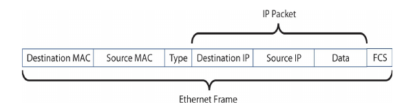
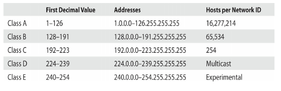

## Network Models

**The OSI seven layers are**

- Layer 7 Application > APIs > Data
- Layer 6 Presentation > Data Conversion > Data
-  Layer 5 Session > Session tracking/naming > Data
-  Layer 4 Transport > Segmentation/Reassembly >Port Number > Segments
- Layer 3 Network > IP ADDRESS > Packet
- Layer 2 Data Link > MAC ADDRESS > Frame
- Layer 1 Physical > Cabling > Bits

**The TCP/IP Model**

* Application > layer 5,6,7 > Data

* Transport > layer 4 > TCP segment / UDP datagram

* Internet > layer 3 > IP Packet
* Link/Network Interface > layer 1,2 > Frame

## Cabling and Topologies

**Network Topologies**

- bus
- ring
- star
- hybrid
- mesh

**Cabling**

- Copper Cable

  - Coaxial Cable

  - Twisted Pair

    - Shielded Twisted Pair

    - Unshielded Twisted Pair

      

  

- Fiber-Optics

- Classic Serial *old fashion*

- Parallel *old fashion*

## TCP/IP Basics

**# Internet layer**

The Internet Protocol (IP) works at the Internet layer, taking data chunks from the Transport layer, adding addressing, and creating the final IP packet. IP then hands the IP packet to Layer 2 for encapsulation into a frame.

IP V4 ex *192.168.1.115*

IP V6 ex *2001:0:4137:9e76:43e:2599:3f57:fe9a*

IPv4 and IPv6 addresses aren’t the only protocols that work at the Internet layer. Several applications test basic issues at this layer, asking questions such as: “Is there a computer with the IP address of  92.168.1.15?” These applications use the Internet ControlMessage Protocol (ICMP). TCP/IP users rarely start a program that uses ICMP. For the most part, ICMP features are called automatically by applications as needed without direct user action. There are very useful programs that run under ICMP, however, such as the ping utility.

When thinking about the Internet layer, remember the following three protocols:

- IPv4 (normally referred to as simply “IP”)
- IPv6
- ICMP

 Highly simplified  IP header looks like `|Version|32 bit|DSCP|TTL|TCP|`

- Version The version (Ver) field defines the IP address type: 4 for IPv4, 6 for IPv6.
- Header length The total size of the IP portion of the packet in words (32 bits) is displayed in the header length field.
- Differentiated services code point (DSCP) The DSCP field contains data used by bandwidth-sensitive applications like Voice over IP. (Network techs with long memories will note that this field used to be
  called the type of service field.)
- Time to live (TTL) Implementations of routers on the Internet are not perfect and engineers sometimes create loops. The TTL field prevents an IP packet from indefinitely spinning through the Internet by using a counter that decrements by one every time a packet goes through a router. This number cannot start higher than 255; many applications start at 128.
- Protocol In the vast majority of cases, the protocol field is either TCP or UDP and identifies what’s encapsulated inside the packet. See the next section for more information.

**# Transport Layer Protocols**
When moving data from one system to another, the TCP/IP protocol suite needs to know if the communication is connection-oriented or connectionless.

When you want to be positive that the data moving between two systems gets there in good order, use a connection-oriented application. If it’s not a big deal for data to miss a bit or two, then connectionless is the
way to go. The connection-oriented protocol used with TCP/IP is called the Transmission Control Protocol (TCP). The connectionless one is called the User Datagram Protocol (UDP).

Let me be clear: you don’t choose TCP or UDP. The people who developed the applications decide which protocol to use. When you fire up your Web browser, for example, you’re using TCP because Web browsers use a protocol called Hypertext Transfer Protocol (HTTP) and the developers of HTTP decided to build HTTP using TCP.

- **TCP**
  Most TCP/IP applications use TCP—that’s why we call the protocol suite “TCP/IP” and not “UDP/IP.” TCP gets an application’s data from one machine to another reliably and completely. As a result, TCP comes with communication rules that require both the sending and receiving machines to acknowledge the other’s presence and readiness to send and receive data. We call this process the TCP three-way handshake of SYN, SYN-ACK, and ACK . TCP also chops up data into segments, gives the segments
  a sequence number, and then verifies that all sent segments were received. If a segment goes missing, the receiving system must request the missing segments.

  simplified TCP header be like `|source port|destination port|sequence number|ACK|`. Notice the source port and the destination port. Port numbers are values ranging from 1 to 65,535 and are used by systems to determine what application needs the received data. Each application is assigned a specific port number on which to listen/send. Web servers use port 80 (HTTP) or 443 (HTTPS), for example, whereas port 143 is used to receive e-mail messages from e-mail servers (IMAP4).

  The client uses the source port number to remember which client application requested the data. The rest of this book dives much deeper into ports. For now, know that the TCP or UDP headers of an IP packet store these values.
  Ports aren’t the only items of interest in the TCP header. The header also contains these fields:

  - **Sequence** and ACK numbers These numbers enable the sending and receiving computers to keep track of the various pieces of data flowing back and forth.
  - **Flags** These individual bits give both sides detailed information about the state of the connection.
  - **Checksum** The checksum checks the TCP header for errors.

- **UDP**
  UDP is the “fire and forget” missile of the TCP/IP protocol suite. As you can see `|source port|destination port|lemght|checksum|` a UDP datagram doesn’t possess any of the extras you see in TCP to make sure the data is received intact. UDP works best when you have a lot of data that doesn’t need to be perfect or when the systems are so close to each other that the chances of a problem occurring are too small to bother worrying about. A few dropped frames on a Voice over IP call, for example, won’t make much difference in the communication between two people. So, there’s a good reason to use UDP: it’s smoking fast compared to TCP. Two of the most important networking protocols, Domain Name System (DNS) and Dynamic Host Configuration Protocol (DHCP), use UDP.

**# Application Layer Protocols**

TCP/IP applications use TCP/IP protocols to move data back and forth between servers and clients. Because every application has different needs, I can’t show you a generic application header. Instead, we’ll look at one sample header from one function of possibly the most popular application
protocol of all: HTTP.

**# IP and Ethernet**
TCP/IP supports simple networks and complex networks. You can use theprotocol suite to connect a handful of computers to a switch and create a local area network (LAN). TCP/IP also enables you to interconnect multiple LANs into a wide area network (WAN). Let’s start by understanding how IP
addressing works in a simple network, a LAN.

At the LAN level, every host runs TCP/IP software over Ethernet hardware, creating a situation where every host has two addresses: an IP address and an Ethernet MAC address. While at first this seems redundant, it’s the power behind TCP/IP’s ability to support both LANs and WANs. But again, we’re only talking about LANs at this point.

Note that the IP packet is completely encapsulated inside the Ethernet frame. Also note that the Ethernet frame has both a destination MAC address and a source MAC address, while the IP packet encapsulated in the Ethernet frame has both a source IP address and a destination IP address. This encapsulation idea works great, but there’s a problem: Computer A knows Computer B’s IP address, but how does Computer A know the MAC address of Computer B? 

To get Computer B’s MAC address, Computer A sends a very special command called an Address Resolution Protocol (ARP) request to MAC address FF-FF-FF-FF-FF-FF, the universal MAC address for broadcast

Computer B responds to the ARP request by sending Computer A an ARP reply . Once Computer A has Computer B’s MAC address, it starts sending unicast Ethernet frames directly to Computer B.

IP addresses provide several benefits that MAC addresses alone cannot offer. First, every machine on a TCP/IP network—small or large—gets a unique IP address that identifies the machine on that network. Second, IP addresses group together sets of computers into logical networks, so you can, for example, distinguish one LAN from another. Finally, because TCP/IP network equipment understands the IP addressing scheme, computers can communicate with each other between LANs, in a WAN. Let’s go into more detail on IP addresses.

**# IP Addresses in Action**
Now that you understand that an IP address is nothing more than a string of 32 ones and zeroes, it’s time to (finally) see how IP addressing supports WANs. It’s important to keep in mind that the IP numbering system must support both WANs and the many LANs connected by the WANs. This can create problems in some circumstances, such as when a computer needs to send data both to computers in its own network and to computers in other networks at the same time.
To make all this work, the IP numbering system must do three things:

- Create network IDs, a way to use IP addresses so that each LAN has its own identification.
- Interconnect the LANs using routers and give those routers some way to use the network identification to send packets to the right network.
- Use a subnet mask to give each computer on the network a way to recognize if a packet is for the LAN or for a computer on the WAN, so it knows how to handle the packe

**# Network IDs**
A WAN is nothing more than a group of two or more interconnected LANs.
For a WAN to work, each LAN needs some form of unique identifier called a
network ID.
To differentiate LANs from one another, each computer on a single LAN must share a very similar, but not identical, IP address. Some parts of the IP address will match all the others on the LAN

**# Interconnecting LANs**
To organize all those individual LANs into a larger network, every TCP/IP LAN that wants to connect to another TCP/IP LAN must have a router connection. There is no exception to this critical rule. A router, therefore, needs an IP address on every LAN that it interconnects , so it can correctly send (route) the packets to the correct LAN.

The router interface that connects a single LAN to the router is known as the default gateway. In a typical scenario configuring a client to access the network beyond the router, you use the IP address of the default gateway. The default gateway is in the same network ID as the host. The person who sets up the router must make sure that they configure the router’s LAN interface to have an address in the LAN’s network ID. By convention, most network administrators give the LAN-side NIC on the default gateway the lowest host address in the network, usually the host ID of 1. Therefore, if a network ID is 22.33.4.x, the router is configured to use the address 22.33.4.1. Routers use network IDs to determine network traffic.

Now let’s add in the LAN and the Internet. When discussing networks in terms of network IDs, by the way, especially with illustrations in books, the common practice is to draw circles around stylized networks.
Here, you should concentrate on the IDs—not the specifics of the networks.

Network IDs are very flexible, as long as no two interconnected networks share the same network ID. If you wished, you could change the network ID of the 202.120.10.0 network to 202.155.5.0, or 202.21.8.0, just as long as you can guarantee no other LAN on the WAN shares the same network ID. On the Internet, powerful governing bodies carefully allocate network IDs to ensure no two LANs share the same network ID. 

So far, you’ve only seen examples of network IDs where the last value is zero. This is common for small networks, but it creates a limitation. With a network ID of 202.120.10.0, for example, a network is limited to IP addresses from 202.120.10.1 to 202.120.10.254. (202.120.10.255 is a broadcast address used to talk to every computer on the LAN.) This provides only 254 IP addresses: enough for a small network, but many organizations need many more IP addresses. No worries! You can simply use a network ID with more
zeroes, such as 170.45.0.0 (for a total of 65,534 hosts) or even 12.0.0.0 (for around 16.7 million hosts).

Network IDs enable you to connect multiple LANs into a WAN. Routers then connect everything together, using routing tables to keep track of which packets go where. So that takes care of the second task: interconnecting the LANs using routers and giving those routers a way to send packets to the
right network.

**# Class IDs**
The Internet is by far the biggest and the most complex TCP/IP internetwork. Numbering over half a billion computers already a decade ago, it has grown so quickly that now it’s nearly impossible to find an accurate number. One challenge for the Internet is to make sure no two devices share the same public IP address. To support the dispersion of IP addresses, an organization called the Internet Assigned Numbers Authority (IANA) was formed to track and disperse IP addresses to those who need them. Initially handled by a single person (the famous Jon Postel) until 1998, IANA has grown dramatically and now oversees five Regional Internet Registries (RIRs) that parcel out IP addresses to large ISPs and major corporations. The RIR for North America is called the American Registry for Internet Numbers (ARIN).

All end users get their IP addresses from their respective ISPs. IANA passes out IP addresses in contiguous chunks called network blocks (or just blocks), which are outlined in the following table:

