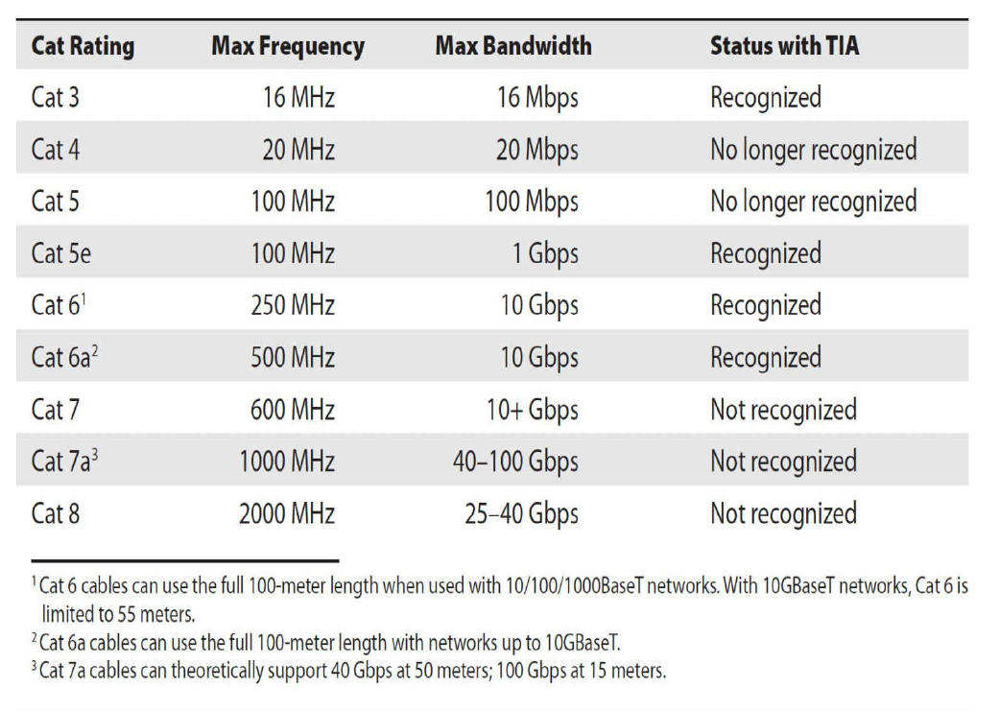

## Network Models

**The OSI seven layers are**

- Layer 7 Application > APIs > Data
- Layer 6 Presentation > Data Conversion > Data
-  Layer 5 Session > Session tracking/naming > Data
-  Layer 4 Transport > Segmentation/Reassembly >Port Number > Segments
- Layer 3 Network > IP ADDRESS > Packet
- Layer 2 Data Link > MAC ADDRESS > Frame
- Layer 1 Physical > Cabling > Bits

**The TCP/IP Model**

* Application > layer 5,6,7 > Data

* Transport > layer 4 > TCP segment / UDP datagram

* Internet > layer 3 > IP Packet
* Link/Network Interface > layer 1,2 > Frame

## Cabling and Topologies

**Network Topologies**

- bus
- ring
- star
- hybrid
- mesh

**Cabling**

- Copper Cable

  - Coaxial Cable

  - Twisted Pair

    - Shielded Twisted Pair

    - Unshielded Twisted Pair

      

  

- Fiber-Optics

- Classic Serial *old fashion*

- Parallel *old fashion*